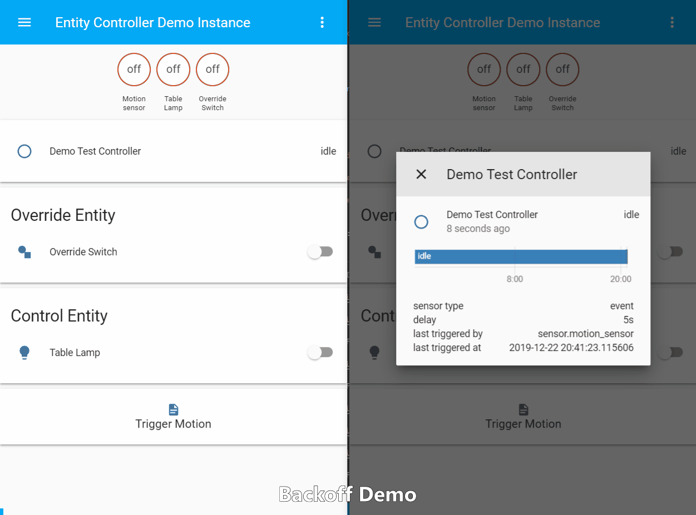
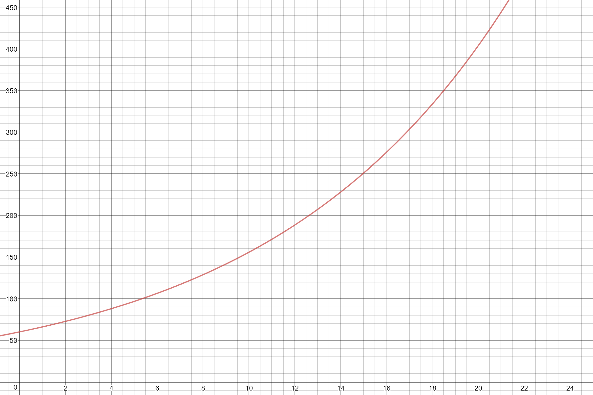

# Exponential Backoff
Enabling the `backoff` option will cause `delay` timeouts to increase exponentially by a factor of `backoff_factor` up until a maximum timeout value of `backoff_max` is reached.



The graph below shows the relationship between number of sensor triggers and timeout values for the shown parameters.
```
  delay: 120
  backoff: true
  backoff_factor: 1.2
  backoff_max: 600
```


