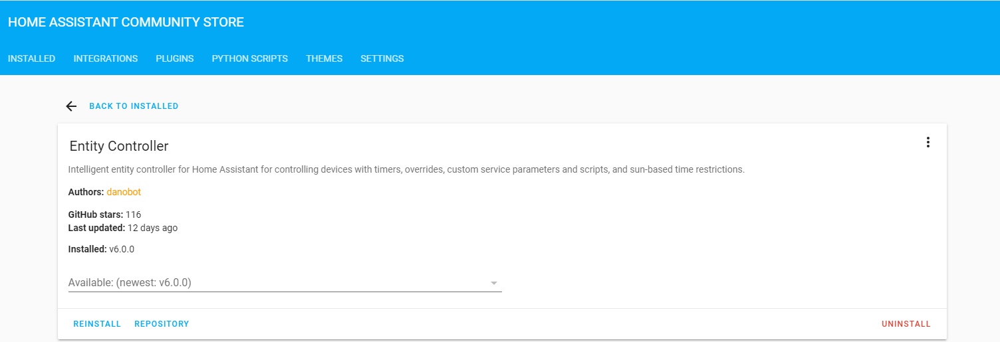

# Installation
EC is distributed via the Home assistant Community Store (HACS). You need to set up HACS first if you are starting on a new Home Assistant installation. Once installed, EC can be found in the Integrations tab under "Entity Controller".



# Automatic updates using HACS
EC is available on the Home Assistant Community Store (HACS). This is the recommended installation method to benefit from automated updates and quick release adoption. 


# Configuration
EC is ~very~ ~extremely~ _overwhelmingly_ configurable (too much for one developer to handle in their spare time). The following documentation section explain the different ways you can configure EC. In its most basic form, you can define a sensor, an entity and a delay.


The controller needs `sensors` to monitor (such as motion detectors, binary switches, doors, weather, etc) as well as an entity to control (such as a light).


```yaml
entity_controller:
  motion_light:                               # serves as a name
    sensor: binary_sensor.living_room_motion  # required, [sensors]
    entity: light.table_lamp                  # required, [entity,entities]
    delay: 300                                # optional, overwrites default delay of 180s
```

**Note:** The top-level domain key `entity_controller` will be omitted in the following examples.
